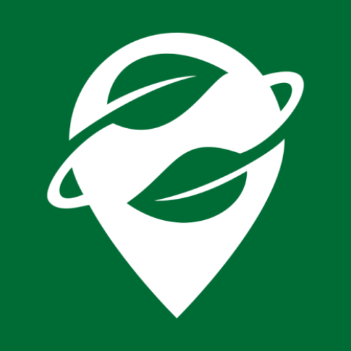

<div align="center">
  
</div>
<h1 align="center">Organic Maps — Rider Fork</h1>

Android-only fork of [Organic Maps](https://organicmaps.app), the privacy-first
offline maps & GPS app powered by [OpenStreetMap](https://www.openstreetmap.org)
data. It adds **Rider Live Tracking** and drops the iOS, Qt desktop and map
generator trees.

## Rider Live Tracking

A group of riders share their live position through a self-hosted relay server
and see each other as labelled markers on the map, including during turn-by-turn
navigation.

Nothing is enabled by default. Sharing stays off until switched on, and the app
only ever talks to the server address you enter yourself — no Organic Maps
backend is involved.

### How it works

- Every device generates a random **rider code** on first launch. Share yours
  with friends; add theirs to see them.
- While sharing is on, each location update is POSTed to your server
  (`code`, `name`, `lat`, `lon`, `speed`, `bearing`).
- Friend positions are polled every 5 seconds and drawn by a transparent overlay
  above the map surface. Markers are re-projected every frame, so labels follow
  pan, zoom, rotation and the navigation tilt.
- The server keeps locations in memory only and expires them after a TTL, so a
  rider who stops sharing disappears on their own.

### Setup

**Settings → Riders → Rider Live Tracking**

| Setting                  | Purpose                                                  |
| ------------------------ | -------------------------------------------------------- |
| Server URL               | Base URL of your relay, e.g. `http://192.168.1.100:8080` |
| Server Username/Password | HTTP Basic Auth credentials, if the server requires them |
| My Rider Code            | Your code — share it with friends                        |
| My Name                  | Optional label shown instead of the code                 |
| Share my location        | Master switch for publishing your position               |
| Show myself              | Draw your own marker too, useful for testing             |
| Friend codes             | Codes of the riders you want to see                      |

The relay server is a single stdlib-only Python file in
[`tools/rider_server/`](tools/rider_server/):

```bash
RIDER_USER=alice RIDER_PASS=<your-password> python3 tools/rider_server/rider_server.py
```

See [`tools/rider_server/README.md`](tools/rider_server/README.md) for the API,
environment variables, and deployment notes.

### Privacy and security

- Location leaves the device **only** while "Share my location" is on, and only
  to the server you configured.
- A rider code is a shared secret: anyone holding it can see that rider's live
  position. Rotate your code if it leaks.
- Basic Auth credentials are sent in cleartext over plain HTTP — put the server
  behind TLS (nginx, Caddy) for anything beyond a trusted LAN.

## Building

```bash
cd android && ./gradlew assembleGoogleDebug -Parm64
```

Prebuilt debug APKs are attached to the
[releases](../../releases). See [docs/INSTALL.md](docs/INSTALL.md) for toolchain
setup.

## Credits

Organic Maps is created and maintained by the MapsWithMe (MAPS.ME) founders and
developed by the open-source community at
[organicmaps/organicmaps](https://github.com/organicmaps/organicmaps).
Map data © [OpenStreetMap](https://www.openstreetmap.org/copyright) contributors.
This fork only adds the rider tracking feature on top of their work — see
[CONTRIBUTORS](CONTRIBUTORS) for the full list of contributors.

## License and Copyrights

The code is licensed under the Apache License, Version 2.0. See [LICENSE](LICENSE),
[NOTICE](NOTICE) and
[data/copyright.html](http://htmlpreview.github.io/?https://github.com/organicmaps/organicmaps/blob/master/data/copyright.html)
for more information.

Binary data files (including, but not limited to `.mwm` map files) are provided
under a separate license. See [DATA_LICENSE.txt](DATA_LICENSE.txt) for details.

### Attribution

Per the upstream attribution terms: if you use Organic Maps binary data (e.g.
maps), source code, or its user interface in your project, include a visible,
human-readable mention of the "Organic Maps Project" and a clickable link to
https://organicmaps.app. This notice should appear in user-visible locations,
such as the product's "About" and "Main Menu" screens.
